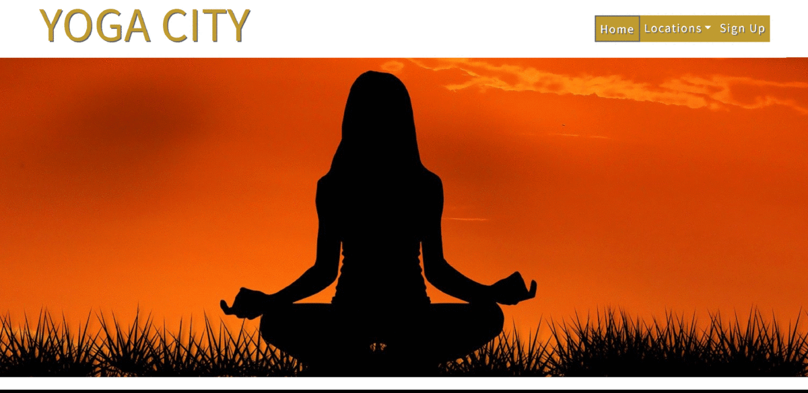

# Yoga City 
_Find peace within yourself with yoga._  
At Yoga City you receive high-level guidance. 
You will be pampered and challenged at the same time. 
You will learn which feelings you have and how to listen to those feelings. 
You are completely focused on yourself and on the other hand we are more connected than ever.  
__Come and connect with us.__

## Demo
[Live website](https://kimkesdev.github.io/YogaCity/.)

## UX

### User Stories

<strong>User Story 1:</strong> Inexperienced people who want to start practicing yoga. 
<strong>User Story 2:</strong> Advanced yoga practitioners who want more than just yoga. 
<strong>User Story 3:</strong> People who want to be spiritual connected. 
<strong>User Story 4:</strong> People who want to have more flexible muscles. 
<strong>User Story 5:</strong> People who want to find more inner peace. 
<strong>User Story 6:</strong> People who want to start learning more about there feelings. 
<strong>User Story 7:</strong> People who want to be physically and mentally challenged.  
<strong>User Story 8:</strong> People who want to find peace within thereselfs. 

### Strategy
This website is for people in Noord-Holland who want to practise yoga within a save environment.
A beautiful location where you can feel connected to yourself and others.
The yoga lessons are available every workday at different locations trough Noord-Holland.
The three available locations are bigger cities in Noord-Holland.

### Scope 
The website is easy to read and easy to use.
The website provides basic yoga information, the available locations and a sign up form.
The sign up form is a very clear form with radiobuttons for the preferred yoga day and location.
Every location has his own Google Map with the yoga location in the middle.
Every page has a link to the sign-up form.

### Structure
Every page has the same fixed header. 
Every page has the same footer.  
__index.html__  
The page starts with a yoga image to get in the right yoga mood. 
Underneath the image will all the general information about Yoga City with links to the three locations. 
Followed by basic yoga information and yoga history.  
__alkmaar.html__ 
__hoorn.html__ 
__zaandam.html__ 
All three pages with the same structure. 
Starting with three yoga images. 
Followed by the location information and a sign-up link. 
Underneath a full width Google Map with the location name in the middle.  
__signup.html__  
The sign up page will have a yoga image on the background. 
On top of the image will be the sign-up form. 
With radionbuttons for every yoga location and radiobuttons for every yoga day. 
Followed by a name and email text field and a button for sending the form. 
When the form is send, you will be directed the the Thank You page.  
__thankyou.html__  
This page will have one big _Thank You_ image.

### Skeleton
__Header:__  
Same fixed header on every page. 
White background and golden title with menu.  

__Menu:__  
The menu items will be within golden circles.  
All lined up horizontally in large size, hamburger icon in medium and small size. 
On every page it will be visible, which page is active. 
There will be a grey circle around the menu item with the golden circle. 
When the page _Alkmaar_, _Hoorn_ or _Zaandam_ is selected, the active circle will be around the _Location_ menu item. 

__Footer:__  
The footer is white with grey icons, all lined up horizontally. 
On small, medium and large devices, the icons stay all horizontally. 

__All Pages:__  
White background, text in dark grey, titles in gold. 
Big yoga images. Full width or side by side. 
With a sign-up link, which will link you to _signup.html_.  

__Form:__  
See trough form with five radio buttons for each week day, all lined up vertically.  
Followed by three radio buttons for each location, all lined up vertically.  
Two wide required text fields with name and email address. 
When the send button is pressed, it will lead you to the _thankyou.html_ page. 

__Maps:__ 
Each location will have his own Google Map with his own Google Maps API Key and his own JavaScript form.  
The location name in the middle of the map.   

### Surface
All text with font family: 'Noto Sans JP'. 
All text with font color: #666666 (dark grey). 
All titles with font color: #bf9b30 (gold) 

  

__Header__ 
The uppercase title will be on the left in the color gold with text shadow #666666 (dark grey). 
The navigation menu will be horizontally on the right on large devices.  
Each navigation menu item will be placed in a seprate golden circle.  
The active page will have a grey border around the golden circle of the navigation menu. 
The golden circle of the navigation menu will get a shadow element below the circle, when hover over. 
When the _locations_ menu item is pressed, there will be a collapsable menu with the available locations. 
The collapsed menu will have the location names vertical, dark grey text with a white background.
On small and medium devices the menu will become a collapsable menu or _hamburger_ menu. 
The _hamburger_ menu will have a golden border. 

__Footer__ 
Starting on the left with an _email_ icon, which will direct you to your email program. 
Next the _phone_ icon, which will directly start calling. 
Followed by the _Facebook_, _Twitter_, _YouTube_ and _Instagram_ icon, which will lead you to the right external webpage. 

__Home page / index.html__ 
Starting with a big image, full width on all devices. 
Followed by a white block with text.  
The titles and the sign up link are color gold.  
The sign up link will link to the _sign-up_ page. 
The sign up link will change to color silver when hover over. 
And at the bottom here will be four images. 
On large devices there will be two images, full width. And then again two images, full width. 
On medium and small devices there will be one image, full width. Four images underneath each other. 
All four images will have a hover over effect. 
In the top left of each image will show a text quote. 
Text color white and background color dark grey and a little bit transparant. 

__Locations__ 
Each location will have the same build up. 
Starting with three images. 
On small and medium devices the three images will be full width underneath each other. 
On large devices there will be one image, full width. Underneath that image will be two images next to each other, full width. 
Followed by a white block with text.  
The titles and the sign up link are color gold.  
The sign up link will link to the _sign-up_ page. 
Next to each title will be a playful icon. 
At the bottom will be a map, full width, with a marker with the location name.  
The map will be zoomed in and the area surrounding of the yoga location is clearly visible. 
The title and location text will be in big white letters for good visabilatyin, the background of the marker will be color gold.  
The golden background will have a little tip underneath, so it looks like a text balloon. 

__Sign Up__ 
One big image will fill the page, full width. 
On small and medium devices the form will be place in the center. 
On large devices the form will be place on the left. 
The sign up form will have the color dark grey and is a little bit transparant so you can still see the image.  
The title will be color gold with next to the title a playful icon. 
The title will have a hover over effect and will change the text color to silver and will have a shine effect. 
The rest of the text will be white. 
Three verticaly radio buttons for each location. 
The locations are in alphabetical order.  
Automatically the first selectable radiobutton is selected. 
Followed by five verticaly radio buttons for each day of the week. 
Automatically the first selectable radiobutton is selected. 
Underneath the radio buttons will be two text input field underneath each other for the name and e-mail address.  
These are required field. 
The borders will be color white, with hoover over effect to change them to color gold. 
When the send button is pressed and the required fields are not filled in, the borders of the required text fields will change to red with a red cross at the end. 
And at the bottom will be a submit button with white text and the background color gold.  
With hoover over effect to change the text color to gold and the background color to silver.

__Thank You__ 
This page is only accessible when the sign-up form is send. 
No menu item will be active on this page.

### Mockups
The following wireframes were created using Balsamiq to design the website layout options:
 
[Small devices](assets/mockups/YogaCityLarge.pdf) 
[Medium devices](assets/mockups/YogaCityMedium.pdf) 
[Large devices](assets/mockups/YogaCityLarge.pdf)

## Features
The webpage consists of the following features:  
__Bootstrap form__ 
The sign-up form uses Bootstrap form features. 
Radio buttons, to choose the preferred options. 
The form has required text fields for the name and email address.
  
__Bootstrap Icons__ 
All grey icons are used in the footer for social media, phone and email, linked to the right place. 
In the fixed header is a home icon, linked to the _index.html_. 
In the fixed header is a _hamburger_ icon only on small and medium devices. 
Next to a lot of titles is a playful icon, they are not linked.
  
__Bootstrap Button__ 
The sign-up form uses a Bootstrap button, which is styled with CSS.
  
__Bootstrap Navbar__ 
Makes the _locations_ button a drop down list.
  
__Google Maps__ 
Each location has his own API key and his own JavaScript form.

## Technologies

### Languages
[HTML5](https://en.wikipedia.org/wiki/HTML5) for the structure of the website  
[CSS](https://en.wikipedia.org/wiki/Cascading_Style_Sheets) for the styling  
[JavaScript](https://en.wikipedia.org/wiki/JavaScript) for the Google Maps

### Frameworks / Tools / Libraries
[Balsamiq](https://balsamiq.com.) for the mockups. 
[Bootstrap](https://getbootstrap.com/) for the collapsible navbar, button and the footer icons 
[Google Fonts](https://fonts.google.com/) for the font family 'Noto Sans JP' 
[Gitpod](https://www.gitpod.io/) was the IDE used to write the code for this website 
[GitHub](https://github.com/) for version control

### Testing
[HTML Validator](https://validator.w3.org/) for testing the HTML code 
[CSS Validator](https://jigsaw.w3.org/css-validator/) for testing the CSS code 
Google Chrome Developer Tools for testing different device sizes

## Testing

__Responsiveness__ 
Every page was tested for responsiveness on small, medium and large devices. 
Through the _Google Chrome Developer Tools_ I tested the following types: 
<ul>
  <li>iPhone 5/SE (portrait: 320x568 & landscape: 568x320)
  <li>Galaxy S5/Moto G4 (portrait: 360x640 & landscape: 640x360)
  <li>iPhone 6/7/8 (portrait: 375x667 & landscape: 667x375)
  <li>iPhone X (portrait: 375x812 & landscape: 812x375)
  <li>Pixel 2 (portrait: 411x731 & landscape: 731x411)
  <li>Pixel 2 XL (portrait: 411x823 & landscape: 823x411)
  <li>iPhone 6/7/8 Plus (portrait: 414x736 & landscape: 736x414)
  <li>iPad (portrait: 768x1024 & landscape: 1024x768)
  <li>iPad Pro (portrait: 1024x1366 & landscape: 1366x1024)
</ul>

This site was also tested in [Responsinator](https://www.responsinator.com/). 

  

__Header__ 
The header is fixed and responsive to small, medium and large devices.
  
__Navigation menu__ 
The links in the navigation menu are linked to the right internal webpage.
  
__Footer__ 
In the footer the social media links will be found, which are external links.
There are also contact icons, which will can be used to get in contact right away.
  
__Sign-up form__ 
The sign-up form has required attributes which are needed before submitting the form.

## Testing results
HTML validator tested on the following pages:
index.html, alkmaar.html, hoorn.html, zaandam.html, signup.html, thankyou.html

 
CSS validator tested on the following page:
style.css 

## Deployment
I started working on this project in Repl.it because I worked on it from different devices.
Every time I was on my own laptop I copied everything to GitPod and pushed it to GitHub.
Like this I also always had an extra backup, when needed.
  
This website contains the following html pages:
<ul>
  <li>index.html
  <li>alkmaar.html
  <li>hoorn.html
  <li>zaandam.html
  <li>signup.html
  <li>thankyou.html
</ul>
And the following map:
<ul>
  <li>assets
</ul>
Inside the <strong>assets</strong> map I created five new maps:
<ul>
  <li>css
  <li>images
  <li>js
  <li>mockups
  <li>screenshots
</ul>
Inside the <strong>css</strong> map is the css style sheet called <strong>style.css</strong>. 
Inside the <strong>images</strong> map are all the images used on the website. 
Inside the <strong>js</strong> map are the three JavaScript sheets with the Google Maps information. 
Inside the <strong>mockups</strong> map are the three mockups for small, medium and large devices. 
Inside the <strong>screenshots</strong> map are all screenshots used in the README.md. 
Ending with the README.md

### New Repository in GitHub
First you need an account on [GitHub](https://github.com) which you can download from [here](https://desktop.github.com). 
<ol>
  <li>Click <strong>Create a New Repository</strong>.
  <li>At <strong>Repository template</strong> you can select a template, if you have one.
  <li>At <strong>Repository name</strong> you can choose the name for you new repository.
  <li>At <strong>Description (optional)</strong> you give you repository a decription.
  <li>Next you can choose if you want a <strong>Public</strong> or a <strong>Private</strong> repository.
  <li><strong>Initialize this repository with a README</strong> you click this checkbox if you like to create a README file.
  <li>Click the green button with <strong>Create repository</strong>.
</ol>

### Creating a branch
To create a branch link you have to go to your repository in GitHub and follow the following steps:
<ol>
  <li>Click on <strong>settings</strong>.
  <li>Scroll down to <strong>GitHub Pages</strong>.
  <li>At <strong>Source</strong> the button stands on <strong>None</strong>, click it and select <strong>master branch</strong>.
  <li>Your site is ready to be published at (your branch name).
</ol>

### Push from GitPod to GitHub
When you make some changes in GitPod you can push them to GitHub.
<ol>
  <li>In GitPod click on <strong>Source Control: Git</strong>.
  <li>In the textfield you can give your changes a message name.
  <li>Underneath the line <strong>CHANGES</strong>, you see all the changes that have been made. Press the <strong>+</strong> button behind the page name which you want to be pushed. You can also press the <strong>+</strong> button next to the line <strong>CHANGES</strong>, to push all the made changes.
  <li>Klink the <strong>Commit</strong>.
  <li>On the right, press the GitPod logo with the name <strong>Pull Request</strong>.
  <li>A yellow field appears. Click the blue button with <strong>Push</strong>.
</ol>
    
### Create your own Google API key
To start you need to have a Google Account and start at the [Google Cloud Platform Console](https://cloud.google.com/console/google/maps-apis/overview).
<ol>
  <li>On the top of the Google Cloud Platform Console, next to the text <strong>Google Cloud Platform</strong> you see a drop project drop down menu.
  <li>When you click it, you will get a pop up with all your projects, if you have any.
  <li>Click on <strong>New Project</strong>.
  <li>Fill in your <strong>Project Name</strong> and click <strong>Create</strong>.
  <li>Go to your new project and click on <strong>Credentials</strong>.
  <li>Go to <strong>Credentials in APIs & Services</strong>.
  <li>Click on <strong>Create Credentials</strong> and <strong>API Key</strong>.
  <li>Copy your API Key code and paste into your website.
</ol>

## Credits

### Content
The full content is made up and written by me.

### Media
The photos used in this website were obtained from [Unsplashed](https://unsplash.com/).

### Acknowledgements
Everything I learned from the [Code Institute](https://codeinstitute.net/) Fullstack Web Development course. 
I used [W3Schools](https://www.w3schools.com/) for extra general coding knowledge. 
I used the [Google Maps](https://developers.google.com/maps/documentation/javascript/get-api-key) site to create three API key's and for general information. 
I used [Bootstrap](https://getbootstrap.com/) for info about forms and offcourse to use the icons, buttons and navbar. 
