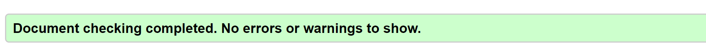
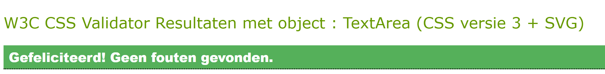

# Yoga City 
_Find peace within yourself with yoga._  
At Yoga City you receive high-level guidance. 
You will be pampered and challenged at the same time. 
You will learn which feelings you have and how to listen to those feelings. 
You are completely focused on yourself and on the other hand we are more connected than ever.  
__Come and connect with us.__

## Demo
[Live website](https://kimkesdev.github.io/YogaCity/.)

## UX

### User Stories

<strong>User Story 1:</strong> Inexperienced people who want to start practicing yoga. 
<strong>User Story 2:</strong> Advanced yoga practitioners who want more than just yoga. 
<strong>User Story 3:</strong> People who want to be spiritual connected. 
<strong>User Story 4:</strong> People who want to have more flexible muscles. 
<strong>User Story 5:</strong> People who want to find more inner peace. 
<strong>User Story 6:</strong> People who want to start learning more about there feelings. 
<strong>User Story 7:</strong> People who want to be physically and mentally challenged.  
<strong>User Story 8:</strong> People who want to find peace within thereselfs. 

### Strategy
This website is for people in Noord-Holland who want to practise yoga within a save environment.
A beautiful location where you can feel connected to yourself and others.
The yoga lessons are available every workday at different locations trough Noord-Holland.
The three available locations are bigger cities in Noord-Holland.

### Scope 
The website is easy to read and easy to use.
The website provides basic yoga information, the available locations and a sign up form.
The sign up form is a very clear form with radiobuttons for the preferred yoga day and location.
Every location has his own Google Map with the yoga location in the middle.
Every page has a link to the sign-up form.

### Structure
Every page has the same fixed header.  
Every page has the same footer.  
The __index.html__ page starts with a yoga image to get in the right yoga mood.
Underneath the image will all the genarl information about Yoga City with links to the three locations.
Followed by basic yoga information and yoga history.
At the bottom some yoga images with a hoover over quote on top of each image.  
The locations button will give you the three location options.  
__alkmaar.html hoorn.html and zaandam.html__ are three pages with the same structure.
Starting with three yoga images.
Followed by the location information and a sign-up link.
Underneath a full width Google Map with the location name in the middle.  
__signup.html__ will have a yoga image on the background.
On top of the image will be the sign-up form.
With radionbuttons for every yoga day and radiobuttons for every yoga location.
Followed by a name and email text field and a button for sending the form.
When the form is send, you will be directed the the Thank You page.  
__thankyou.html__ is only available when the sign-up form is send.
One thank you image.

### Skeleton / uiterlijk, navigatie, menu's, layout, blokken, buttons
__Header:__ gold & white. 
__Menu:__ menu items within golden circles. 
__Footer:__ white with grey icons, all lined up horizontally. 
__Pages:__ text with white background and big images. 
__Form:__ see trough form with radio buttons and required text with big image on background. 
__Maps:__ each location with own map.

### Surface / details 
Font family: 'Noto Sans JP'. 
Font color: #666666 (dark grey). 
Font color titles: #bf9b30 (gold), with a text shadow element. 
Some hover over titles change font color from gold to font color: #c0c0c0 (silver).  

  
__Header__ 
Full width white background with on the left the title in the color gold with text shadow.
The navigation menu will be horizontally on the right. Each navigation item will be placed in a seprate golden circle.
The active page will have a grey border around the golden circle of the navigation menu.
The golden circle of the navigation menu will get a shadow element below the circle, when hover over.
When the locations menu item is pressed, there will be a collapsable menu with the available locations.
  
__Footer__ 
The footer will be the same at all pages and all sizes.
White with light gray icons horizontally.
With social media and contacting icons. All linking to the right place.
  
__Home page__ 
Starting with a big image, full width.
Followed by a white block with text. The titles and the sign up link are color gold. The sign up link will link to the right page.
And the bottom here will be four images.
On large devices there will be two images, full width. And then again two images, full width.
On medium and small devices there will be one image, full width. Four images underneath each other.
All four images will have a hover over effect. In the top left of the image will show a text quote with transparant background.
  
__Sign Up__ 
One image, full width.
The sign up form will be transparant on top of the image. 
The title will be color gold with a hover over effect. Next to the title will be a playful icon.
The hover over effect will change the text color to silver and will have a shine effect.
Three verticaly radio buttons for each location, where the client can choose from.
Followed by five verticaly radio buttons for each day of the week, where the client can choose from.
Underneath the radio buttons will be two verticaly text input field for the name and e-mail address. 
The borders will be color white, with hoover over effect to change them to color gold.
And at the bottum will a submit button. White text with background color gold. 
With hoover over effect to change the text color to gold and the background color to silver.
  
__Locations__ 
Each location will have the same build up.
Starting with three images.
On large devices there will be one image, full width. Underneath that image will be two images next to each other, full width.
On medium and small devices the three images will be places underneath each other, all full width.
Followed by a white block with text. 
The titles and the sign up link are color gold. The sign up link will link to the right page.
Next to each title will be a playful icon.
At the bottom will be a map, full width, with a marker on the right location. 
The map will be zoomed in and the area surrounding of the yoga location is clearly visible.
The marker will have the title and location text in big white letters for good visabilaty, background color gold. 

### Mockups
The following wireframes were created using Balsamiq to design the website layout options:
 
[Small devices](assets/mockups/YogaCityLarge.pdf) 
[Medium devices](assets/mockups/YogaCityMedium.pdf) 
[Large devices](assets/mockups/YogaCityLarge.pdf)

## Features
The webpage consists of the following features:  
__Navigation menu__ 
The navbar stays collapsed on small and medium devices and a Bootstrap bar icon is used.
The navbar contains links to associated pages: Home, Locations (Alkmaar, Hoorn, Zaandam) and Sign-Up.
  
__Footer__ 
Clear white footer containing all icon with links to social media accounts and contactinfo.
  
__Sign up form__ 
The sign-up form uses Bootstrap form features.
The form requires to provide your name and email address.
When the required fields are filled in and you press the button, you will be forwarded to the _Thank You page_.
  
__Icons__ 
All light grey Bootstrap icons are used for social media and to get in contact.
  
__Button__ 
The sign-up form uses a Bootstrap button, which is styled with CSS.

## Technologies

### Languages
[HTML5](https://en.wikipedia.org/wiki/HTML5) for the structure of the website  
[CSS](https://en.wikipedia.org/wiki/Cascading_Style_Sheets) for the styling  
[JavaScript](https://en.wikipedia.org/wiki/JavaScript) for the Google Maps

### Frameworks / Tools / Libraries
[Balsamiq](https://balsamiq.com.) for the mockups. 
[Bootstrap](https://getbootstrap.com/) for the collapsible navbar, button and the footer icons 
[Google Fonts](https://fonts.google.com/) for the font family 'Noto Sans JP' 
[Gitpod](https://www.gitpod.io/) was the IDE used to write the code for this website 
[GitHub](https://github.com/) for version control

### Testing
[HTML Validator](https://validator.w3.org/) for testing the HTML code 
[CSS Validator](https://jigsaw.w3.org/css-validator/) for testing the CSS code 
Google Chrome Developer Tools for testing different device sizes

## Testing

__Responsiveness__ 
Every page was tested for responsiveness on small, medium and large devices. 
Through the _Google Chrome Developer Tools_ I tested the following types: 
<ul>
  <li>iPhone 5/SE (portrait: 320x568 & landscape: 568x320)
  <li>Galaxy S5/Moto G4 (portrait: 360x640 & landscape: 640x360)
  <li>iPhone 6/7/8 (portrait: 375x667 & landscape: 667x375)
  <li>iPhone X (portrait: 375x812 & landscape: 812x375)
  <li>Pixel 2 (portrait: 411x731 & landscape: 731x411)
  <li>Pixel 2 XL (portrait: 411x823 & landscape: 823x411)
  <li>iPhone 6/7/8 Plus (portrait: 414x736 & landscape: 736x414)
  <li>iPad (portrait: 768x1024 & landscape: 1024x768)
  <li>iPad Pro (portrait: 1024x1366 & landscape: 1366x1024)
</ul>

This site was also tested in [Responsinator](https://www.responsinator.com/). 

  

__Header__ 
The header is fixed and responsive to small, medium and large devices.
  
__Navigation menu__ 
The links in the navigation menu are linked to the right internal webpage.
  
__Footer__ 
In the footer the social media links will be found, which are external links.
There are also contact icons, which will can be used to get in contact right away.
  
__Sign-up form__ 
The sign-up form has required attributes which are needed before submitting the form.

## Testing results
HTML validator tested on the following pages:
index.html, alkmaar.html, hoorn.html, zaandam.html, signup.html, thankyou.html

 
CSS validator tested on the following page:
style.css 

## Deployment
I started working on this project in Repl.it because I worked on it from different devices.
Every time I was on my own laptop I copied everything to GitPod and pushed it to GitHub.
Like this I also always had an extra backup, when needed.
 
This website starts with the: index.html, followed by the map ‘assets’, with a map of ‘images’ and a map of ‘css’.
In the ’css’ map you will find the page: style.css.
A map called 'mockups' with small, medium and large wireframes.
A map called 'screenshots' with an image of the used colors and a demo.gif.
Ending with the README.md.

### New Repository
### Deployment in GitHub
### Clone and contribute
### Create your own Google API keys

## Credits

### Content
The full content is made up and written by me.

### Media
The photos used in this website were obtained from [Unsplashed](https://unsplash.com/).

### Acknowledgements
[Code Institute](https://codeinstitute.net/) Fullstack Web Development course. 
[W3Schools](https://www.w3schools.com/) for extra general coding knowledge. 
[Google Maps](https://developers.google.com/maps/documentation/javascript/get-api-key) API key info. 
[Bootstrap](https://getbootstrap.com/) for info about forms. 
